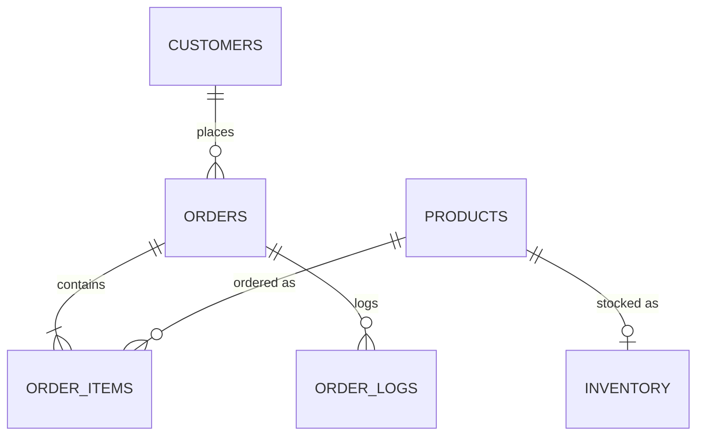

# CloudMart

A serverless e-commerce backend on AWS with an operations dashboard. It provides Product, Customer and Order REST APIs (API Gateway + Lambda + RDS MySQL), token-based authorization, event-driven email alerts, a nightly CSV sales report, CloudWatch monitoring, and a Flask dashboard on EC2. Everything is deployed as CloudFormation/SAM stacks through GitHub Actions.

- **Region:** `ap-south-1` (Mumbai)
- **Environment:** `dev` (templates also accept `prod`)
- **Runtime:** Python 3.12 (Lambda), Flask 3 (dashboard)


## Repository layout

```
infrastructure/cloudformation/
  network.yml            VPC, subnets, security groups, VPC endpoints
  data.yml               RDS MySQL + subnet group
  iam.yml                IAM roles + SSM parameters (DB config, bucket, auth token)
  auth-stack.yml         Lambda Authorizer + Init Schema Lambda        (SAM)
  event-driven-stack.yml SNS topics, EventBridge bus + rules
  application.yml        Product / Customer / Order Lambdas + API Gateway (SAM)
  reporting-stack.yml    S3 report bucket, Report Lambda, daily schedule (SAM)
  monitoring-stack.yml   CloudWatch dashboard, alarms, alarm SNS topic
  dashboard-stack.yml    EC2 instance running the Flask dashboard
src/
  authorizer/            Bearer-token authorizer
  init-schema/           lambda_function.py + schema.sql
  product/  customer/  order/  report/
  dashboard/             Flask app (app.py, templates/, static/)
.github/workflows/deploy.yml
database-diagram.md
```

---

## Deployment

Pushing to `main` or `changes` (or running the workflow manually) triggers `deploy.yml`. Jobs run strictly in sequence because stacks depend on each other's CloudFormation exports:

| # | Job | Stack | Notes |
|---|---|---|---|
| 1 | validate | – | `validate-template` on every template |
| 2 | network | `cloudmart-network` | exports VPC, subnet and SG IDs |
| 3 | database | `cloudmart-data` | needs `DB_PASSWORD`; waits for RDS availability |
| 4 | iam | `cloudmart-iam` | `CAPABILITY_NAMED_IAM`; verifies exports |
| 5 | auth | `cloudmart-auth` | SAM build/deploy of authorizer + init-schema |
| 6 | event-driven | `cloudmart-event-driven` | needs `LOW_STOCK_EMAIL`, `ORDER_NOTIFICATION_EMAIL` |
| 7 | application | `cloudmart-application` | SAM build/deploy of the three APIs |
| 8 | reporting | `CloudMart-Reporting-dev` | bucket `cloudmart-dev-reports-test` (Retain) |
| 9 | monitoring | `CloudMart-Monitoring-dev` | dashboard `cloudmart-operations-dev` + alarms |
| 10 | dashboard | `CloudMart-Dashboard-dev` | EC2, user-data clones the `dashboard` branch |

### GitHub secrets

| Secret | Purpose |
|---|---|
| `AWS_ROLE_ARN` | IAM role assumed via GitHub OIDC |
| `DB_PASSWORD` | RDS master password (also stored in SSM by `iam.yml`) |
| `LOW_STOCK_EMAIL` | Subscriber for low stock alerts |
| `ORDER_NOTIFICATION_EMAIL` | Subscriber for order notifications |

After the first deploy, confirm the SNS subscription emails (low stock, order notifications, and monitoring alarms if you subscribe to that topic).

### Initialise the database

The pipeline creates the empty RDS instance but does not run the schema. Invoke the init-schema Lambda once:

```bash
aws lambda invoke \
  --function-name CloudMart-InitSchema-dev \
  --region ap-south-1 out.json && cat out.json
```

It creates the database, all tables, and the sample customers, products and inventory. It is idempotent (`IF NOT EXISTS` / `ON DUPLICATE KEY UPDATE`).

---

## Database

MySQL 8.0 with six tables: `customers`, `products`, `inventory`, `orders`, `order_items`, `order_logs`. See **[database-diagram.md](database-diagram.md)** for the full ER diagram, indexes and the order status lifecycle.



Connection settings are read at runtime from SSM Parameter Store under `/app/<env>/database/{host,port,name,username,password}`.

---

## Authentication and authorization

Every request (except public product reads and customer sign-up) must carry:

- `Authorization: Bearer <token>`
- `customer_id` as a query parameter **or** in the JSON body

The authorizer hashes the token with SHA-256 and matches it against `customers.token_hash` for that `customer_id`, then returns the role in the request context. Results are not cached (`AuthorizerResultTtlInSeconds: 0`).

| Role | Allowed |
|---|---|
| `ANONYMOUS` | `GET /product`, `GET /product/{id}` (no token) |
| `USER` | read products; create/list/read/cancel own orders |
| `PRODUCT_OWNER` | read products and orders; create/update/delete products |
| `ADMIN` | everything, including customer management |

The Lambdas additionally enforce ownership (a `USER` can only access their own customer record and orders).

### Sample dev accounts (from `schema.sql`)

| customer_id | Role | Email | Token |
|---|---|---|---|
| 1 | ADMIN | admin@cloudmart.com | `admin@123` |
| 2 | PRODUCT_OWNER | owner@cloudmart.com | `product@123` |
| 3 | USER | john@cloudmart.com | `john@123` |
| 4 | USER | sarah@cloudmart.com | `sarah@123` |
| 5 | USER | michael@cloudmart.com | `michael@123` |

> These are development credentials only. Remove or rotate them before any real use.

---

## API reference

Base URL: `https://<api-id>.execute-api.ap-south-1.amazonaws.com/dev` (the `ProductApiUrl` output of `cloudmart-application`).

### Products

| Method | Path | Description |
|---|---|---|
| GET | `/product` | List active products with inventory (public) |
| GET | `/product/{id}` | Get one product (public) |
| POST | `/product` | Create product + inventory |
| PUT | `/product/{id}` | Update product fields and/or inventory |
| DELETE | `/product/{id}` | Soft delete (`is_active = FALSE`) |

### Customers

| Method | Path | Description |
|---|---|---|
| POST | `/customer` | Register (no auth); role is always `USER`; token auto-generated if omitted and returned once |
| GET | `/customer` | List all (ADMIN) |
| GET | `/customer/{id}` | Get own record (ADMIN: any) |
| PUT | `/customer/{id}` | Update name/email/token; `role` is ADMIN only |
| DELETE | `/customer/{id}` | Delete (ADMIN); 409 if the customer has orders |

### Orders

| Method | Path | Description |
|---|---|---|
| POST | `/order` | Create order: `{"customer_id": 3, "items": [{"product_id": 1, "quantity": 2}]}` |
| GET | `/order` | List orders (USER: own only) |
| GET | `/order/{id}` | Order with items and audit log |
| GET | `/order/customer/{id}` | Orders for a customer |
| PUT | `/order/{id}` | Advance status (`CONFIRMED→PROCESSING→SHIPPED→DELIVERED`) |
| PATCH | `/order/{id}` | Cancel order and restore inventory |

Order creation locks the product rows (`SELECT ... FOR UPDATE`), validates stock, and either confirms the order and deducts inventory, or stores it as `FAILED` with the reason. Both outcomes return HTTP 201 with the resulting `status`.

Example:

```bash
curl -X POST "$API/order?customer_id=3" \
  -H "Authorization: Bearer john@123" \
  -H "Content-Type: application/json" \
  -d '{"customer_id": 3, "items": [{"product_id": 2, "quantity": 1}]}'
```

---

## Event-driven notifications

Custom EventBridge bus `cloudmart-<env>-event-bus`:

| Source | Detail types | Target |
|---|---|---|
| `cloudmart.product` | `Low Stock Alert` | SNS `cloudmart-<env>-low-stock-alerts` |
| `cloudmart.order` | `Order Confirmed`, `Order Shipped`, `Order Delivered`, `Order Cancelled`, `Order Failed` | SNS `cloudmart-<env>-order-notifications` |

Low stock fires when product stock is created or updated at/below `reorder_threshold`, or when an order drops stock across the threshold.

## Reporting

`CloudMart-Daily-Report-<env>` (EventBridge Scheduler) invokes the Report Lambda every day at **23:00 IST**. It writes a single CSV of the last 24 hours (summary, inventory, orders, order items, order logs) to:

```
s3://<report-bucket>/reports/daily/<YYYY-MM-DD>/cloudmart-daily-report-<timestamp>.csv
```

The bucket is versioned, AES-256 encrypted, fully private, and has `DeletionPolicy: Retain`.

## Monitoring

`cloudmart-operations-<env>` CloudWatch dashboard covers API Gateway, all four Lambdas, RDS, and business metrics from the `CloudMart/Operations` namespace (`OrdersPlaced`, `OrdersCancelled`, `OrdersFailed`, `LowStockEvents`).

Alarms (all notify `CloudMart-<env>-Monitoring-Alarms`): orders failed/cancelled/low stock, RDS CPU ≥ 80% and free storage < 5 GB, Lambda errors (product, order, authorizer, report), order Lambda throttles, and API Gateway 4XX/5XX.

## Dashboard

A Flask app behind Nginx on a public-subnet EC2 instance (`http://<public-ip>`). It shows products, customers, orders, inventory units, revenue, low-stock items, and lists/downloads the S3 reports. It calls the API server-side as customer `1` (ADMIN) and reads its token from SSM `/app/<env>/auth/token`.

Local run:

```bash
cd src/dashboard
pip install -r requirements.txt
ENVIRONMENT=dev API_URL=https://<api-url> REPORT_BUCKET=<bucket> python app.py   # http://127.0.0.1:8000
```

---


