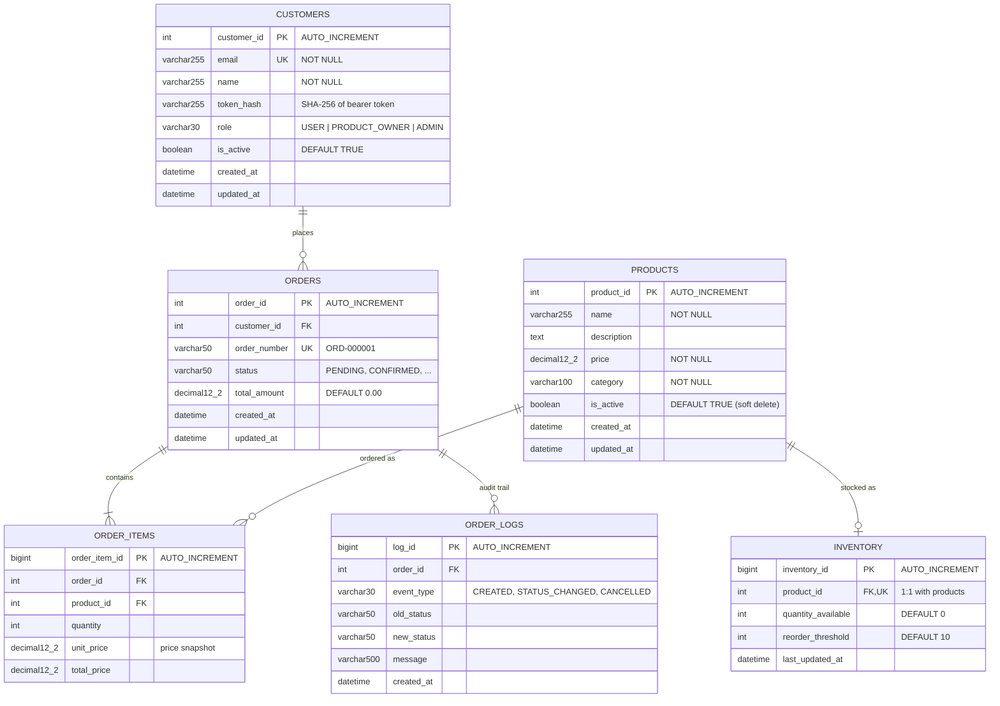

# CloudMart Database Diagram

Engine: MySQL 8.0 on RDS (`db.t3.micro`, private subnets). Schema source: `src/init-schema/schema.sql`.

## Relationships

| Parent | Child | Cardinality | FK constraint |
|---|---|---|---|
| customers | orders | 1 : N | `fk_orders_customer` |
| orders | order_items | 1 : N | `fk_order_items_order` |
| products | order_items | 1 : N | `fk_order_items_product` |
| products | inventory | 1 : 0..1 | `fk_inventory_product` (+ UNIQUE on `product_id`) |
| orders | order_logs | 1 : N | `fk_order_logs_order` |

## Indexes

- `customers`: `idx_customers_active (is_active)`, `idx_customers_role (role)`, unique `email`
- `products`: `idx_products_category (category)`, `idx_products_active (is_active)`
- `orders`: unique `order_number`
- `inventory`: unique `product_id`
